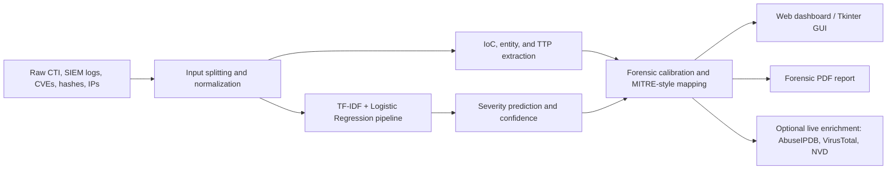
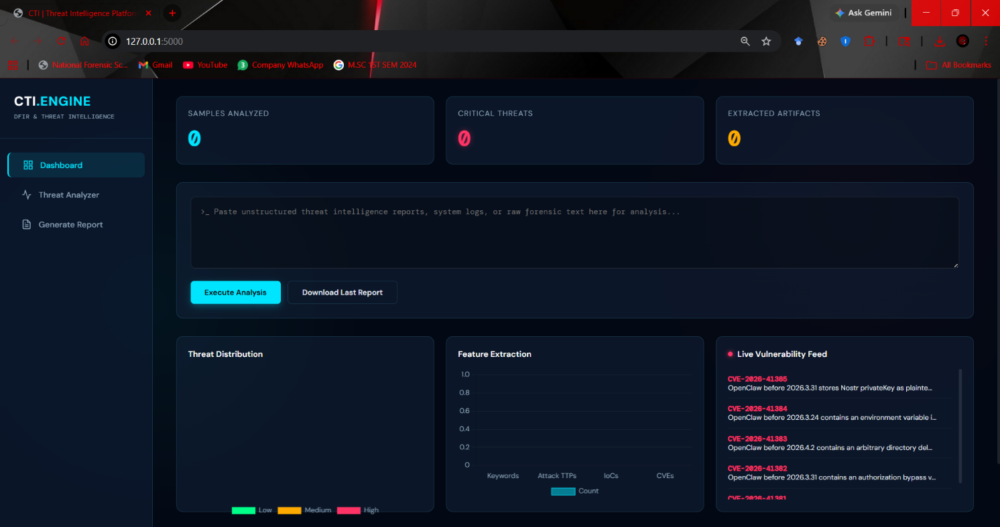
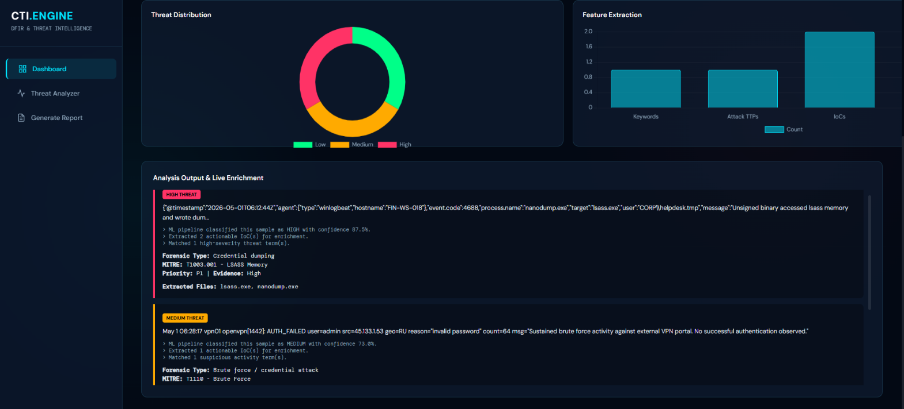
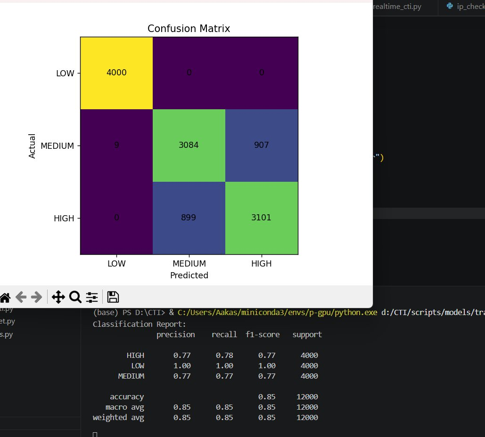
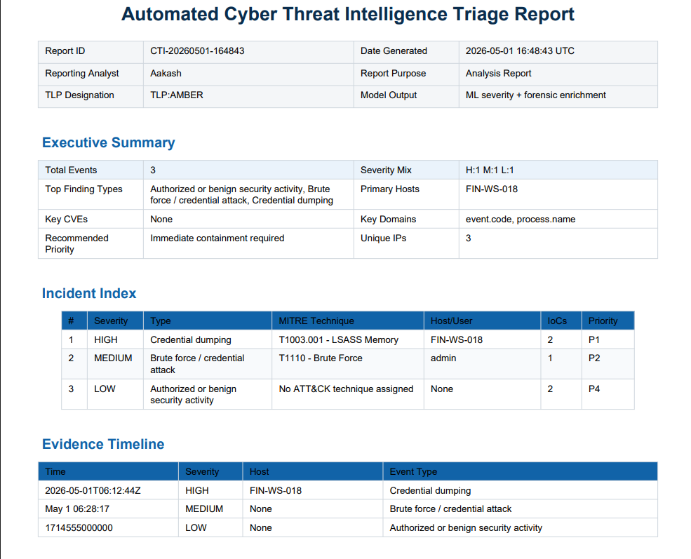

# Automated Cyber Threat Intelligence Triage System

An end-to-end CTI and SOC triage assistant that converts raw cyber threat intelligence, SIEM-style logs, indicators, CVE references, and analyst text into severity predictions, extracted IoCs, MITRE-style context, and forensic PDF reports.

The system was built as part of the dissertation **"An Automated Cyber Threat Intelligence Triage System"** by Aakash Sorout. It combines a TF-IDF + Logistic Regression severity classifier with deterministic forensic enrichment logic so the output is useful for SOC Level-1 triage, digital forensics review, and analyst handoff documentation.

## Highlights

- Classifies raw CTI or log text into `HIGH`, `MEDIUM`, and `LOW` severity.
- Extracts IoCs such as IP addresses, hashes, CVEs, domains, files, hosts, users, processes, and event IDs.
- Maps suspicious behavior to MITRE-style tactics and techniques.
- Calibrates model output with forensic rules for common SOC cases such as ransomware, RCE, credential dumping, brute force, scanning, benign update traffic, and authorized scanner activity.
- Provides a Flask web dashboard and a Tkinter desktop interface.
- Generates structured forensic PDF reports with executive summary, incident index, timeline, detailed findings, IoCs, MITRE mapping, evidence value, and response actions.
- Supports optional live enrichment through AbuseIPDB, VirusTotal, and NVD CVE feeds.

## Architecture



## Screenshots and Diagrams

### Web Dashboard



### Analysis Results




### Model Evaluation





### Forensic Report Output




More project figures are available in [`docs/figures`](docs/figures).


## Repository Layout

```text
.
|-- data/
|   |-- raw/                 # Recreated locally from source feeds; not committed
|   `-- processed/           # Rebuilt dataset artifacts; large CSVs are not committed
|-- docs/
|   |-- figures/             # Thesis/project screenshots and diagrams
|   |-- API.md
|   |-- DATASETS.md
|   `-- MODEL_CARD.md
|-- models/
|   |-- cti_pipeline.pkl
|   `-- cti_pipeline_metrics.json
|-- scripts/
|   |-- build_dataset.py
|   |-- feature_engineering/
|   |-- gui/
|   |-- inference/
|   |-- models/
|   `-- realtime/
|-- utils/
|   `-- report_generator.py
`-- webapp/
    |-- app.py
    `-- templates/index.html
```

## Quick Start

1. Create and activate a Python environment.

```powershell
python -m venv .venv
.\.venv\Scripts\Activate.ps1
pip install -r requirements.txt
```

2. Optional: configure live enrichment keys.

```powershell
Copy-Item .env.example .env
# Edit .env and set ABUSEIPDB_API_KEY and VT_API_KEY if you want live lookups.
```

3. Start the Flask dashboard.

```powershell
python webapp/app.py
```

4. Open the dashboard.

```text
http://127.0.0.1:5000
```

## Running Inference from Python

```python
from scripts.inference.predict_cti import predict_cti

sample = "CVE-2024-3400 active exploitation with webshell and command and control traffic."
result = predict_cti(sample)

print(result["prediction"])
print(result["confidence"])
print(result["indicators"])
print(result["forensic"])
```

## Model Performance

The production model uses a scikit-learn Pipeline:

- Vectorizer: `TfidfVectorizer`
- Classifier: `LogisticRegression`
- N-grams: `(1, 2)`
- Maximum features: `50,000`
- Evaluation: stratified 80/20 split after duplicate removal
- Rows after cleaning: `43,701`
- Held-out test size: `8,741`
- Accuracy: `82.45%`

Per-class F1-scores from `models/cti_pipeline_metrics.json`:

| Class | Precision | Recall | F1-score | Support |
| --- | ---: | ---: | ---: | ---: |
| HIGH | 0.7385 | 0.7957 | 0.7661 | 2,389 |
| MEDIUM | 0.7990 | 0.8112 | 0.8050 | 3,660 |
| LOW | 0.9535 | 0.8681 | 0.9088 | 2,692 |

## Data Sources

The training workflow uses:

- MITRE ATT&CK Enterprise attack-pattern descriptions.
- NIST NVD CVE feeds for 2022, 2023, and 2024.
- APT campaign report text.
- Synthetic LOW-severity administrative/security templates.
- Synthetic MEDIUM suspicious telemetry templates.
- Raw SIEM-style samples in JSON, CEF, syslog, Suricata, proxy, and Windows-style formats.

Large raw feeds and generated CSV datasets are intentionally excluded from GitHub. See [`docs/DATASETS.md`](docs/DATASETS.md) for reconstruction notes.

## API Documentation

See [`docs/API.md`](docs/API.md) for endpoint details.

## Security Notes

Do not commit API keys. Live enrichment modules read:

- `ABUSEIPDB_API_KEY`
- `VT_API_KEY`

If these variables are not set, the app still runs and returns a clear "not configured" message for live enrichment.

## Intended Use

This project is a research and analyst-assistance tool. It should support SOC triage and digital forensic review, not replace analyst judgment. All generated reports should be reviewed before being used in an investigation record.
